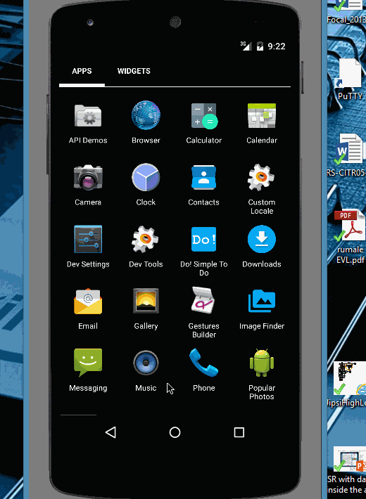

# GridImageSearch
Google Image Search app which allows a user to select search filters and paginate results infinitely

Time spent in total: 8 hours 

Completed user stories: 
* [x] Required: User can enter a search query that will display a grid of images from Google Image API
* [x] Required: User can click on "settings which allows selection of advance search options to filter results
* [x] Required: User can configure advanced search filter such as:
    * Size (Small, medium, large, extra-large)
    * Color filter
    * Type (Faces, photo, clip art, line art)
    * Site
* [x] Required: Once configured all subsequent seaches will have the filters applied
* [x] Required: User can tap on any image in results to see the image full-screen
* [x] User can scroll down infinitely to continue loading images results (upto 8 pages)

Advanced
* Use the ActionBar SearchView instead of EditText
Walkthrough of all user stories:

